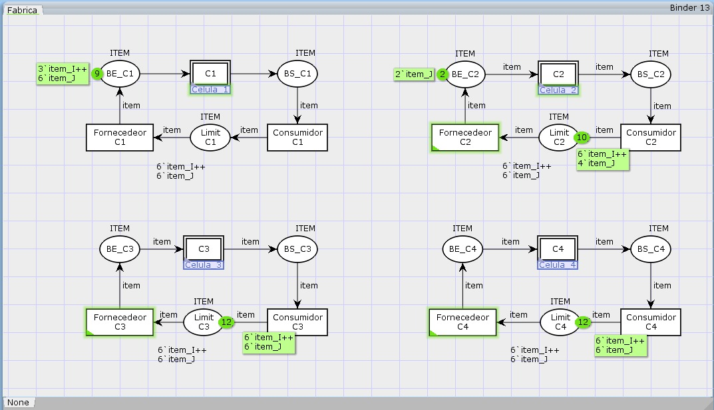

# Modelagem de Sistema de Manufatura com Redes de Petri Coloridas (CPN)

Este repositório contém a documentação e arquivos do Projeto 2 da disciplina de Sistemas a Eventos Discretos (SED), que consiste na modelagem de um sistema de manufatura com quatro células idênticas utilizando Redes de Petri Coloridas (CPN) na ferramenta **CPN Tools**.

## Objetivo Geral

Modelar e validar um sistema de manufatura com múltiplas células, máquinas e robôs, utilizando Redes de Petri Coloridas para garantir funcionamento correto e sem bloqueios (deadlocks). O modelo é hierárquico, com temporizações e análises de desempenho.

## Descrição do Sistema

O sistema é composto por **4 células idênticas**, cada uma contendo:

- 1 Buffer de Entrada Principal.
- 1 Buffer de Saída Principal.
- 3 Máquinas de processamento (M1, M2, M3).
- 3 Robôs (R1, R2, R3).

Cada máquina possui depósitos próprios de entrada e saída. A movimentação de itens é realizada da seguinte forma:

- **Robô 1 (R1):** Transporta itens do buffer de entrada da célula para a entrada da Máquina 1.
- **Robô 2 (R2):** Leva itens da saída da Máquina 1 para a entrada das Máquinas 2 ou 3, dependendo da rota (i ou j).
- **Robô 3 (R3):** Leva itens da saída das Máquinas 2 e 3 para o depósito de saída da célula.

Cada célula executa duas possíveis rotas de produção:
- **Rota i:** M1 → M2 → Saída.
- **Rota j:** M1 → M3 → Saída.

## Modelagem no CPN Tools

- Modelo implementado com **Redes de Petri Coloridas**.
- Estrutura **hierárquica**: cada célula é um módulo reutilizável.
- Utilização de **color sets** para representar itens, rotas, células e atributos dos tokens.
- Limite de **4 tokens por buffer** para simular a capacidade máxima.

## Representaçaõ das 4 Células

## Demonstração em Vídeo

Link de acesso ao vídeo no YouTube: 

https://youtu.be/ZRyJCFzJQK8

## Desenvolvedor

    Mateus Figueiredo (mateus.figueiredo@ee.ufcg.edu.br)
    Matheus Lucas     (matheuslucas.farias@ee.ufcg.edu.br)
    Tâmara Ruth       (tamara.santos@ee.ufcg.edu.br)

## Ferramentas Utilizadas

- [CPN Tools](https://cpntools.org)
- Git e GitHub para versionamento e documentação.

